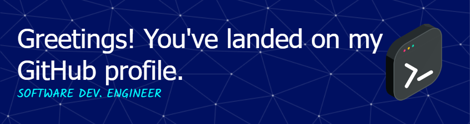

<h1 align="center">Hi 👋, I'm MR. SUJIT</h1>
<h3 align="center">A passionate Web2 & Web3 Developer from India</h3>

  

- 🔭 I’m currently working on **Web2 , Web3 & UI/UX Design**

- 🌱 I’m currently learning **Web3,ML & AI**

- 👯 I’m looking to collaborate on **Innovative Projects**

- 🤝 I’m looking for help with **Learning New Stacks**

- 👨‍💻 All of my projects are available at [https://github.com/sujitmahapatra](https://github.com/sujitmahapatra)

- 📝 I regularly write articles on [https://mrsujitblog.blogspot.com](https://mrsujitblog.blogspot.com)

## 🌐 Socials:
   

# 💻 Tech Stack:
                      	      
# 📊 GitHub Stats:
 
 

### ✍️ Random Dev Quote

### 🔝 Top Contributed Repo

---

  ## 💰 You can help me by Donating
   

  
<!-- Proudly created with GPRM ( https://gprm.itsvg.in ) -->
